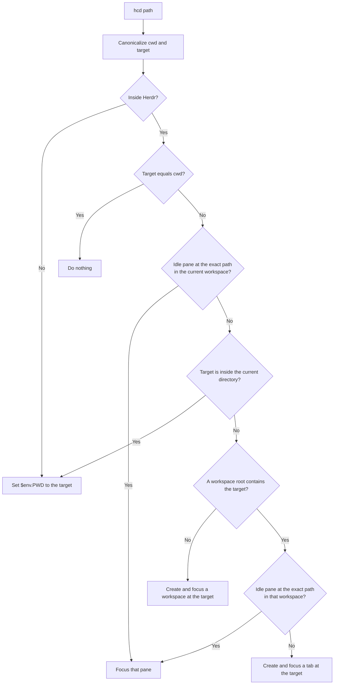

# nu_herdr_cd

Herdr-aware `cd` for Nushell.

```nu
hcd <path: filepath> -> nothing
```

Point `hcd` at a directory and it picks the least disruptive move: stay in this
pane when you go deeper, jump to an idle pane already there, or open a new tab
or workspace. Success is silent.

See [the system design](docs/system-design.md) for architecture, constraints,
and verification. Notable changes are in the [changelog](CHANGELOG.md).

## Prerequisites

- Linux or macOS
- Rust 1.95.0 or later to build from source
- Nushell 0.115
- Herdr 0.8.2 or later inside a Herdr session

Inside Herdr, `hcd` uses only the caller-injected `HERDR_BIN_PATH`. It never
searches `PATH`. Incomplete Herdr context is an error, not a fallback to
ordinary directory change.

## Install

```text
cargo install --git https://github.com/chuang861012/nu_herdr_cd --tag 0.1.1 nu_plugin_herdr_cd
```

Omit `--tag 0.1.1` to install the default branch instead of the 0.1.1 release.

Register the installed binary in Nushell. `plugin add` looks in the current
directory and `NU_PLUGIN_DIRS`; it does not search `PATH`. Cargo's default
install location is `~/.cargo/bin`:

```nu
plugin add ~/.cargo/bin/nu_plugin_herdr_cd
plugin use herdr_cd
hcd ~
```

If Cargo's bin directory is not `~/.cargo/bin`, pass that path instead. To
register by filename alone, add the bin directory to `NU_PLUGIN_DIRS` first.

From a local checkout, use `cargo install --path .` instead. `plugin add` is
not required again after a Nushell restart if the plugin remains in the
registry.

## How `hcd` decides

> [!WARNING]
> `hcd` is opinionated. This version does not provide behavior customization.
> Customization may be added in a future version.

The target must exist, be an enterable directory, and resolve to a canonical
UTF-8 path. `~` and a leading `~/` are expanded. Relative paths are resolved
against the caller's cwd.

### Outside Herdr

If `HERDR_ENV` is absent, `hcd` sets the caller's `$env.PWD` to the canonical
target. It does not change the plugin process's working directory.

Any other `HERDR_ENV` value is an error.

### Inside Herdr

If `HERDR_ENV` is exactly `1`, `hcd` inspects the live session and chooses one
action:



In order:

1. If the target is already the caller's directory, do nothing.
2. If the current workspace already has an idle pane at the exact target,
   focus that pane. The calling pane's directory does not change.
3. If the target is a subdirectory of the current directory, change directory
   in the current pane.
4. Otherwise, use the nearest Herdr workspace whose root contains the target:
   - focus an idle pane already at the exact target, or
   - create and focus a new tab at the target.
5. If no workspace contains the target, create and focus a new workspace
   there.

Going to a parent or sibling never changes the current pane's directory. Busy
panes at the target are skipped; they do not block a directory change or the
creation of a new tab or workspace.

Created tabs and workspaces are focused. The calling pane stays where it is
unless the action is a downward directory change.

### Idle panes

A pane is reused only when its foreground directory is the exact target and it
is idle:

- a shell pane is idle only when process info proves the interactive shell
  itself is in the foreground;
- an agent pane is idle only when its status is `idle` or `done`.

Incomplete process information, `working`, `blocked`, and `unknown` agent
states are never treated as idle.

When several idle panes match, `hcd` prefers the caller's tab, then the
workspace's focused tab, then snapshot list order.

### Examples

| Current directory | Target       | Action                                                              |
| ----------------- | ------------ | ------------------------------------------------------------------- |
| `/repo`           | `/repo/src`  | Change directory, unless an idle pane already sits at `/repo/src`   |
| `/repo/src`       | `/repo`      | Create or focus a tab at `/repo`; never `cd ..` in the current pane |
| `/repo/src`       | `/repo/docs` | Focus an idle pane at `/repo/docs`, or create a tab                 |
| `/repo/src`       | `/other`     | Create and focus a workspace at `/other`                            |

## Configuration

> [!WARNING]
> `hcd` is opinionated. This version does not provide behavior customization.
> Customization may be added in a future version.

There are no flags, environment variables, or config files that change how
`hcd` chooses an action. The decision tree above is the complete behavior.

## Development

```text
cargo fmt --check
cargo clippy --locked --all-targets --all-features -- -D warnings
cargo test --locked --all-targets --all-features
cargo build --release
```

Automated tests do not require an installed Herdr, a running Herdr session, or
changes to the local Nushell plugin registry. They use fake CLI and Unix socket
transports.

GitHub Actions build and test on Linux and macOS for Rust 1.95.0 and latest
stable, using `--locked`. They also run formatting and warning-denied Clippy
on Linux. The workflow has read-only default permissions and does not publish,
deploy, or upload releases.

During development, register the release binary from the checkout:

```nu
plugin add target/release/nu_plugin_herdr_cd
plugin use herdr_cd
```

## Future work

- Windows support
- Configuration
- Extra `cd` forms
- Directory creation
- crates.io or Homebrew packages
- Prebuilt binaries

## License

MIT
