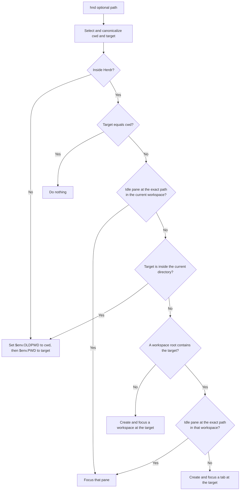

# nu_herdr_navigate_directory

> [!NOTE]
> This is a Nushell plugin that integrates with Herdr. It is not a Herdr
> plugin.

Herdr-aware directory navigation for Nushell.
Inside Herdr, it reuses idle panes when possible to avoid creating unnecessary tabs.

```nu
hnd [path: directory] -> nothing
```

Notable changes are in the [changelog](CHANGELOG.md).

## Prerequisites

- Linux or macOS
- Rust 1.95.0 or later to build from source
- Nushell 0.115
- Herdr 0.8.2 or later inside a Herdr session

Inside Herdr, `hnd` requires the caller-provided `HERDR_BIN_PATH`. It never
searches `PATH` or falls back to an ordinary directory change when Herdr
context is invalid.

## Install

```text
cargo install --git https://github.com/chuang861012/nu_herdr_navigate_directory --tag 0.2.0 nu_plugin_herdr_navigate_directory
```

Omit `--tag 0.2.0` to install the default branch. The 0.1.1 tag uses the
previous `hcd` and `nu_plugin_herdr_cd` names.

Register the binary using Cargo's default install path:

```nu
plugin add ~/.cargo/bin/nu_plugin_herdr_navigate_directory
plugin use herdr_navigate_directory
hnd ~
```

Use your actual Cargo bin directory if it differs from `~/.cargo/bin`. For a
local checkout, install with `cargo install --path .`.

## Supported path forms

`hnd` intentionally supports a smaller set of path forms than Nushell's `cd`:

| Path form                   | Example                         | Supported | Notes                                                                           |
| --------------------------- | ------------------------------- | --------- | ------------------------------------------------------------------------------- |
| Relative path               | `hnd src`                       | ✅        | Resolved against the caller's current directory                                 |
| Parent or current directory | `hnd ..`, `hnd .`               | ✅        | `.` and `..` are resolved before navigation                                     |
| Absolute path               | `hnd /repo/src`                 | ✅        | Must point to an existing, enterable directory                                  |
| Home directory              | `hnd ~`                         | ✅        | Requires the caller's home directory to be available                            |
| Home-relative path          | `hnd ~/src`                     | ✅        | Only a leading `~/` is expanded                                                 |
| Path containing spaces      | `hnd "my dir"`                  | ✅        | Quote the path using normal Nushell syntax                                      |
| Symbolic-link path          | `hnd linked-dir`                | ✅        | Resolved to its canonical physical directory                                    |
| No path                     | `hnd`                           | ✅        | Uses the caller's `HOME`; it must be a non-empty absolute path                  |
| Previous directory          | `hnd -`                         | ✅        | Uses absolute caller `OLDPWD`, or the current directory when `OLDPWD` is absent |
| Literal directory named `-` | `hnd ./-`                       | ✅        | A bare `-` is reserved; `./-` and absolute paths remain literal paths           |
| Named-user home             | `hnd ~otheruser`                | ❌        | `~otheruser` expansion is not implemented                                       |
| Glob                        | `hnd */src`                     | ❌        | Glob expansion is not implemented                                               |
| Multiple paths              | `hnd src tests`                 | ❌        | At most one path is accepted                                                    |
| Flags                       | `hnd --some-flag src`           | ❌        | The command has no flags                                                        |
| Pipeline input              | <code>'/repo' &#124; hnd</code> | ❌        | Pipeline input is not accepted                                                  |

## How `hnd` decides

The target must be an existing, enterable directory with a canonical UTF-8
path. Relative paths use the caller's current directory; `~`, `HOME`, and
`OLDPWD` come from the calling Nushell scope.

### Outside Herdr

Outside Herdr, `hnd` saves the current directory in `$env.OLDPWD`, then updates
`$env.PWD`. Repeated `hnd -` calls therefore toggle between the last two
directories. `HERDR_ENV` must be absent or exactly `1`.

### Inside Herdr

If `HERDR_ENV` is exactly `1`, `hnd` inspects the live session and chooses one
action:



`hnd` reuses only idle panes at the exact target path; busy panes are skipped.
Parent and sibling navigation never changes the current pane, while downward
navigation may. Focusing or creating a Herdr resource leaves `PWD` and
`OLDPWD` unchanged.

### Idle panes

A pane is reused only when its foreground directory is the exact target and it
meets one of these idle conditions:

| Pane type | Treated as idle                                                                                | Not treated as idle                                                |
| --------- | ---------------------------------------------------------------------------------------------- | ------------------------------------------------------------------ |
| Shell     | No agent is detected and process info proves the interactive shell itself is in the foreground | Process info is incomplete or another foreground process is active |
| Agent     | Its status is selected by `idle_agent_statuses`; the default is `idle` or `done`               | Its status is not selected, or is `unknown`                        |

When several idle panes match, `hnd` prefers the caller's tab, then the
workspace's focused tab, then snapshot list order. Every selected agent status
and a proven-idle shell have equal weight.

### Examples

| Current directory | Target       | Action                                                              |
| ----------------- | ------------ | ------------------------------------------------------------------- |
| `/repo`           | `/repo/src`  | Change directory, unless an idle pane already sits at `/repo/src`   |
| `/repo/src`       | `/repo`      | Create or focus a tab at `/repo`; never `cd ..` in the current pane |
| `/repo/src`       | `/repo/docs` | Focus an idle pane at `/repo/docs`, or create a tab                 |
| `/repo/src`       | `/other`     | Create and focus a workspace at `/other`                            |

## Configuration

Set plugin configuration in `config.nu`. The safe, backward-compatible default
is:

```nu
$env.config.plugins.herdr_navigate_directory = {
  dynamic_completion: false
  idle_agent_statuses: [idle done]
}
```

`idle_agent_statuses` accepts `idle`, `done`, `blocked`, and `working`. Order
and duplicates do not matter. An empty list disables agent-pane reuse while
still allowing reuse of proven-idle shell panes.

> [!WARNING]
> Selecting `blocked` or `working` intentionally allows `hnd` to focus and
> reuse panes in those states. The focus is a silent successful action.

Inside Herdr, configuration is strict: unknown keys and invalid or unreadable
values fail before any Herdr action. Outside Herdr, configuration is ignored.
Execution reloads it on every invocation.

### Experimental dynamic completion


Dynamic completion is experimental and disabled by default. Enable it by
changing `dynamic_completion` to `true` in the configuration above.

Inside Herdr, completion can add workspace roots, pane directories, and direct
child directories. It falls back to native Nushell completion outside Herdr or
when inspection fails, and it never changes `hnd` execution.

A typed `-` is the previous-directory sentinel and performs no completion
lookup. Use `./-` for a literal directory named `-`.

> [!NOTE]
> Nushell 0.115 may cache plugin completion results. Put the setting in
> `config.nu` and start a new session after changing it. Setting
> `$env.config.completions.cache_size = 0` provides fresher results but disables
> caching for all Nushell completion and may increase latency.

## Development

```text
cargo fmt --check
cargo clippy --locked --all-targets --all-features -- -D warnings
cargo test --locked --all-targets --all-features
cargo build --release
```

Tests use fake CLI and Unix socket transports, so they do not require Herdr or
changes to the Nushell plugin registry. CI runs the locked test suite on Linux
and macOS with Rust 1.95.0 and stable; it does not publish or deploy.

During development, register the release binary from the checkout:

```nu
plugin add target/release/nu_plugin_herdr_navigate_directory
plugin use herdr_navigate_directory
```

## Future work

- Windows support
- Named-user home expansion and other extra `cd` forms
- Directory creation
- crates.io or Homebrew packages
- Prebuilt binaries

## License

MIT
