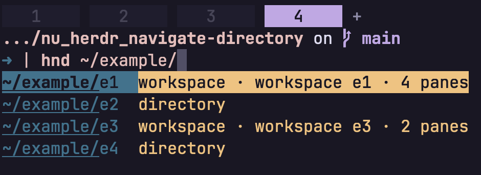

# nu_herdr_navigate_directory

Herdr-aware directory navigation for Nushell.

```nu
hnd <path: directory> -> nothing
```

Point `hnd` at a directory and it picks the least disruptive move: stay in this
pane when you go deeper, jump to an idle pane already there, or open a new tab
or workspace. Success is silent.

See [the system design](docs/system-design.md) for architecture, constraints,
and verification. Notable changes are in the [changelog](CHANGELOG.md).

## Prerequisites

- Linux or macOS
- Rust 1.95.0 or later to build from source
- Nushell 0.115
- Herdr 0.8.2 or later inside a Herdr session

Inside Herdr, `hnd` uses only the caller-injected `HERDR_BIN_PATH`. It never
searches `PATH`. Incomplete Herdr context is an error, not a fallback to
ordinary directory change.

## Install

```text
cargo install --git https://github.com/chuang861012/nu_herdr_navigate_directory nu_plugin_herdr_navigate_directory
```

Add `--tag <version>` to install a source release instead of the default
branch. The 0.1.1 tag still ships the previous `hcd` /
`nu_plugin_herdr_cd` names.

Register the installed binary in Nushell. `plugin add` looks in the current
directory and `NU_PLUGIN_DIRS`; it does not search `PATH`. Cargo's default
install location is `~/.cargo/bin`:

```nu
plugin add ~/.cargo/bin/nu_plugin_herdr_navigate_directory
plugin use herdr_navigate_directory
hnd ~
```

If Cargo's bin directory is not `~/.cargo/bin`, pass that path instead. To
register by filename alone, add the bin directory to `NU_PLUGIN_DIRS` first.

From a local checkout, use `cargo install --path .` instead. `plugin add` is
not required again after a Nushell restart if the plugin remains in the
registry.

## Supported path forms

`hnd` intentionally supports a smaller set of path forms than Nushell's `cd`:

| Path form | Example | Supported | Notes |
| --------- | ------- | --------- | ----- |
| Relative path | `hnd src` | ✅ | Resolved against the caller's current directory |
| Parent or current directory | `hnd ..`, `hnd .` | ✅ | `.` and `..` are resolved before navigation |
| Absolute path | `hnd /repo/src` | ✅ | Must point to an existing, enterable directory |
| Home directory | `hnd ~` | ✅ | Requires the caller's home directory to be available |
| Home-relative path | `hnd ~/src` | ✅ | Only a leading `~/` is expanded |
| Path containing spaces | `hnd "my dir"` | ✅ | Quote the path using normal Nushell syntax |
| Symbolic-link path | `hnd linked-dir` | ✅ | Resolved to its canonical physical directory |
| No path | `hnd` | ❌ | One path argument is required |
| Previous directory | `hnd -` | ❌ | `cd -` behavior is not implemented |
| Named-user home | `hnd ~otheruser` | ❌ | `~otheruser` expansion is not implemented |
| Glob | `hnd */src` | ❌ | Glob expansion is not implemented |
| Multiple paths | `hnd src tests` | ❌ | Exactly one path is accepted |
| Flags | `hnd --some-flag src` | ❌ | The command has no flags |
| Pipeline input | <code>'/repo' &#124; hnd</code> | ❌ | Pipeline input is not accepted |

## How `hnd` decides

The target must exist, be an enterable directory, and resolve to a canonical
UTF-8 path. `~` and a leading `~/` are expanded. Relative paths are resolved
against the caller's cwd.

### Outside Herdr

If `HERDR_ENV` is absent, `hnd` sets the caller's `$env.PWD` to the canonical
target. It does not change the plugin process's working directory.

Any other `HERDR_ENV` value is an error.

### Inside Herdr

If `HERDR_ENV` is exactly `1`, `hnd` inspects the live session and chooses one
action:


In order:

1. If the target is already the caller's directory, do nothing.
2. If the current workspace already has an idle pane at the exact target,
   focus that pane. The calling pane's directory does not change.
3. If the target is a subdirectory of the current directory, change directory
   in the current pane.
4. Otherwise, use the nearest Herdr workspace whose root contains the target:
   - focus an idle pane already at the exact target, or
   - create and focus a new tab at the target.
5. If no workspace contains the target, create and focus a new workspace
   there.

Going to a parent or sibling never changes the current pane's directory. Busy
panes at the target are skipped; they do not block a directory change or the
creation of a new tab or workspace.

Created tabs and workspaces are focused. The calling pane stays where it is
unless the action is a downward directory change.

### Idle panes

A pane is reused only when its foreground directory is the exact target and it
meets one of these idle conditions:

| Pane type | Treated as idle | Not treated as idle |
| --------- | --------------- | ------------------- |
| Shell | No agent is detected and process info proves the interactive shell itself is in the foreground | Process info is incomplete or another foreground process is active |
| Agent | Its status is selected by `idle_agent_statuses`; the default is `idle` or `done` | Its status is not selected, or is `unknown` |

When several idle panes match, `hnd` prefers the caller's tab, then the
workspace's focused tab, then snapshot list order. Every selected agent status
and a proven-idle shell have equal weight.

### Examples

| Current directory | Target       | Action                                                              |
| ----------------- | ------------ | ------------------------------------------------------------------- |
| `/repo`           | `/repo/src`  | Change directory, unless an idle pane already sits at `/repo/src`   |
| `/repo/src`       | `/repo`      | Create or focus a tab at `/repo`; never `cd ..` in the current pane |
| `/repo/src`       | `/repo/docs` | Focus an idle pane at `/repo/docs`, or create a tab                 |
| `/repo/src`       | `/other`     | Create and focus a workspace at `/other`                            |

## Configuration

Set plugin configuration in `config.nu`. The safe, backward-compatible default
is:

```nu
$env.config.plugins.herdr_navigate_directory = {
  dynamic_completion: false
  idle_agent_statuses: [idle done]
}
```

`idle_agent_statuses` controls which detected agent panes may be reused at an
exact target path. It accepts only the exact lowercase values `idle`, `done`,
`blocked`, and `working`. Entries have set semantics: duplicates and order do
not affect selection. An empty list disables agent-pane reuse while preserving
reuse of shell panes whose process information proves the interactive shell is
idle. `unknown` can never be selected.

> [!WARNING]
> Selecting `blocked` or `working` intentionally allows `hnd` to focus and
> reuse panes in those states. The focus is a silent successful action.

The record may contain only `dynamic_completion` and `idle_agent_statuses`.
Inside Herdr, an unreadable config, non-record config, unknown key, invalid list
or member type, or unsupported status returns `invalid_configuration` before
any Herdr operation or directory change. Outside Herdr, `hnd` does not read or
validate plugin configuration. Execution reads the latest configuration once
on every invocation, including the one allowed state recomputation.

### Experimental dynamic completion



Directory completion is experimental and off by default. Enable it in
`config.nu`:

```nu
$env.config.plugins.herdr_navigate_directory = {
  dynamic_completion: true
  idle_agent_statuses: [idle done]
}
```

Only the boolean `true` turns it on. A missing key, `false`, another type, or an
invalid or unreadable plugin config leaves native Nushell directory completion
in place. This flag never changes what `hnd` does when you press Enter.

When enabled inside Herdr, Tab may show workspace roots and pane foreground
directories from the current session alongside direct child directories.
All valid pane paths remain candidates. When duplicate physical paths merge,
`idle_agent_statuses` gives selected statuses reusable-source strength while
descriptions keep the real state, such as `agent blocked`. Descriptions are
informational; `hnd` re-reads live state and current configuration before it
focuses a pane or creates a resource. Outside Herdr, and whenever Herdr cannot
be inspected confidently, completion falls back to native directory
completion.

> [!WARNING]
> Nushell 0.115 may cache plugin completion results for the same command line.
> Put the opt-in in `config.nu` and start a new session. Changing the setting
> interactively is not guaranteed to refresh an already cached answer. The
> plugin does not implement its own cache and does not require disabling
> Nushell's global completion cache. This caching caveat applies to completion
> only; `hnd` execution reads current configuration on every invocation.
>
> If fresh completion results are more important than cache performance, you
> can disable Nushell's completion cache in `config.nu`:
>
> ```nu
> $env.config.completions.cache_size = 0
> ```
>
> This is optional and affects every Nushell completion, not only `hnd`. It may
> increase completion latency, so evaluate the tradeoff for your workflow.

## Development

```text
cargo fmt --check
cargo clippy --locked --all-targets --all-features -- -D warnings
cargo test --locked --all-targets --all-features
cargo build --release
```

Automated tests do not require an installed Herdr, a running Herdr session, or
changes to the local Nushell plugin registry. They use fake CLI and Unix socket
transports.

GitHub Actions build and test on Linux and macOS for Rust 1.95.0 and latest
stable, using `--locked`. They also run formatting and warning-denied Clippy
on Linux. The workflow has read-only default permissions and does not publish,
deploy, or upload releases.

During development, register the release binary from the checkout:

```nu
plugin add target/release/nu_plugin_herdr_navigate_directory
plugin use herdr_navigate_directory
```

## Future work

- Windows support
- Configuration
- Extra `cd` forms
- Directory creation
- crates.io or Homebrew packages
- Prebuilt binaries

## License

MIT
