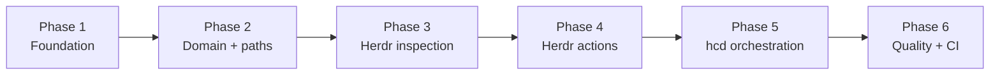

# Implementation Phases

This directory divides the [System Design](../system-design.md) into
independently reviewable implementation phases. The system design is the sole
authority for product behavior and architecture. If a phase document conflicts
with it, correct the phase document before implementing the conflicting work.

## Responsibility labels

Every checklist item uses one of these labels:

- **`[Agent]`**: an implementation agent may complete and verify the item
  locally.
- **`[User action]`**: the user must perform the external, account, publishing,
  or local trust-boundary operation unless it is explicitly delegated.
- **`[User confirmation]`**: an agent may prepare the result and evidence, but
  the user must approve it before the phase gate passes.

`[Agent]` does not remove the need for review. It only means the task does not
require the user to operate an external system or supply a missing decision.

## Phase dependencies

Phases proceed in order. A later-phase test may be written early when useful,
but no later phase may be declared complete before all dependency gates pass.

## Phase index

| Phase | Document                                                | System design sections | Primary deliverable                                | User involvement                            | Status                                |
| ----- | ------------------------------------------------------- | ---------------------- | -------------------------------------------------- | ------------------------------------------- | ------------------------------------- |
| 1     | [Foundation](phase-01-foundation.md)                    | 4–6, 13, 17            | Compilable Rust/Nushell plugin skeleton            | Dependency and boundary review              | Complete                              |
| 2     | [Domain and paths](phase-02-domain-paths.md)            | 7, 9–12                | Canonical path model and pure decision engine      | Decision-table review                       | Complete                              |
| 3     | [Herdr inspection](phase-03-herdr-inspection.md)        | 5, 8–10, 14–15, 17–18  | Typed read-only Herdr integration                  | Inspection evidence review                  | Complete                              |
| 4     | [Herdr actions](phase-04-herdr-actions.md)              | 12, 14–18              | Exact pane focus and create transports             | Action safety review                        | Complete                              |
| 5     | [`hcd` orchestration](phase-05-hcd-orchestration.md)    | 6–17, 19               | Complete command, retry, cancellation, and errors  | Behavior review and optional manual E2E     | Complete                              |
| 6     | [Quality, CI, and distribution](phase-06-quality-ci.md) | 19–21                  | Full local gates, GitHub Actions, and install docs | Push/PR checks and release-readiness review | Awaiting user confirmation            |

Current progress: Phases 1–5 are complete. Phase 6 local quality, CI, and
source-install documentation are implemented. GitHub-hosted verification and
0.1.0 source-readiness approval remain user gates.

## User action and confirmation summary

- [x] [User confirmation] Phase 1: approve the dependency set, Rust/Nushell
      versions, command signature, and module boundaries.
- [x] [User confirmation] Phase 2: review the decision-table evidence against
      the complete navigation tree.
- [x] [User confirmation] Phase 3: confirm that inspection remains read-only,
      fail-closed, and scoped to the caller's live Herdr session.
- [x] [User confirmation] Phase 4: confirm exact-pane focus, create behavior,
      timeout handling, and absence of destructive rollback.
- [x] [User confirmation] Phase 5: review complete command behavior and any
      optional real Nushell/Herdr end-to-end evidence.
- [ ] [User action] Phase 6: push a feature branch and open or update a pull
      request when GitHub-hosted CI verification is desired. Agents never push.
- [ ] [User confirmation] Phase 6: approve the CI results, installation
      documentation, and 0.1.0 source-distribution readiness.

## Completion rule

A phase passes only when:

- every required `[Agent]` implementation and local verification item passes;
- affected system-design and phase documentation is synchronized with the
  implementation;
- the change does not expand scope beyond the system design;
- every required `[User action]` is complete;
- the user explicitly approves every required `[User confirmation]` gate.

Checklist completion records actual verified work, not intent. Do not pre-check
an item because a later phase is expected to cover it.
