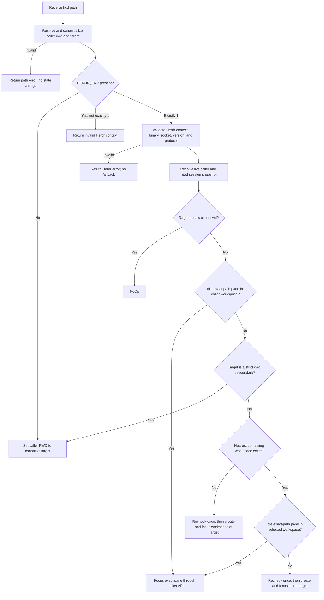

# `nu_herdr_cd` System Design

Status: approved design baseline

Last updated: 2026-08-23

Planned initial version: 0.1.0

Implementation status: Phases 1–5 agent work is complete. Phase 5 wires the
complete `hcd` inspect-decide-act loop, including bounded recomputation, the
10-second total deadline, interruption, structured errors, and fake
transport tests. Successful calls return `nothing`; only `ChangeDirectory`
updates the caller's `$env.PWD`. Phase 5 still requires user confirmation.
Phase 6 has not started. The staged delivery plan is defined in
[Implementation Phases](phases/README.md). This document remains the
authoritative requirements and architecture specification; phase files define
execution order and acceptance gates but must not override this document.

## 1. Overview

`nu_herdr_cd` is a Rust Nushell plugin that exposes one command, `hcd`.
Outside Herdr, `hcd` behaves like a deliberately small subset of `cd`. Inside
Herdr, it reuses an appropriate idle pane when possible, changes the current
pane's directory only for downward navigation, and otherwise creates or
focuses Herdr resources according to a deterministic decision tree.

The plugin is a navigation tool. It does not manage projects, discover Git
repositories, create directories, or manage Herdr named sessions.

## 2. Goals

- Provide `hcd <path>` as a predictable directory-navigation command for
  Nushell.
- Reuse an idle pane at the exact target directory when the pane belongs to
  the relevant Herdr workspace.
- Preserve the current pane when navigation should happen through Herdr.
- Choose the nearest containing workspace deterministically.
- Fail safely when Herdr state cannot be inspected or changed with confidence.
- Keep the decision logic pure and independently testable.

## 3. Non-goals

The initial version will not provide:

- cross-session Herdr navigation;
- Windows support;
- configuration options;
- fuzzy matching, bookmarks, history, or zoxide-style ranking;
- `hcd` with no argument, `cd -`, globs, multiple paths, flags, or pipeline
  input;
- `~otheruser` expansion;
- non-UTF-8 path support;
- directory creation;
- custom tab or workspace labels;
- logging, telemetry, caches, or persistent state;
- crates.io, Homebrew, or prebuilt-binary distribution;
- a direct Herdr socket implementation beyond the one exact-pane focus
  operation required by the public behavior.

## 4. Naming and packaging

| Item | Name |
| --- | --- |
| Repository | `nu_herdr_cd` |
| Cargo package | `nu_plugin_herdr_cd` |
| Binary | `nu_plugin_herdr_cd` |
| Nushell plugin identity | `herdr_cd` |
| Public command | `hcd` |

The crate uses Rust edition 2024 and a declared `rust-version`. As an
application binary, it tracks `Cargo.lock`. Exact `nu-plugin` and
`nu-protocol` versions are recorded in the package manifests; they must use
the same minor version and target the latest stable Nushell plugin SDK
available when implementation begins.

Nushell plugin transport will use `nu_plugin::serve_plugin` with
`MsgPackSerializer`.

## 5. Supported environments

### 5.1 Platforms

The initial version supports Linux and macOS only. Other platforms return an
`unsupported_platform` error before performing an external action.

### 5.2 Herdr compatibility

The minimum supported Herdr version is 0.8.2. Each invocation validates the
server version and protocol metadata returned by its first session snapshot.
The 0.8.2 baseline requires snapshot `version` 0.8.2 or later and snapshot
`protocol` 20 or later. It does not rely on a separate `herdr --version`
result and does not cache the capability result across calls.

Required Herdr capabilities include:

- `session.snapshot` through `herdr api snapshot`;
- live caller resolution through `herdr pane current --current`;
- `foreground_cwd` in pane records;
- `herdr pane process-info`;
- tab and workspace creation with an explicit cwd and focus;
- the socket method `pane.focus` with an exact `pane_id`.

Unknown JSON fields are ignored. Missing required fields, invalid field types,
an unexpected result kind, or a mismatched resource ID are protocol errors.

## 6. Command contract

The signature is conceptually:

```nu
hcd <path: filepath> -> nothing
```

`path` is one required `SyntaxShape::Filepath` positional argument. The command
accepts relative paths, absolute paths, `~`, `~/...`, and paths containing
spaces. Successful calls are silent and return Nushell `nothing`.

The command has no flags and accepts no pipeline input in the initial version.

## 7. Path model

All path identity and containment decisions use canonical physical paths.

Path resolution proceeds as follows:

1. Read the caller's absolute cwd with `EngineInterface::get_current_dir()`.
2. Expand only `~` and a leading `~/` using the caller's home environment.
3. Resolve a relative target against the caller cwd.
4. Canonicalize the caller cwd and target, resolving `.`, `..`, and symbolic
   links.
5. Require the target to exist, be a directory, be enterable, and be
   representable as UTF-8.

The normal-directory-change branch writes the canonical absolute target to
the caller's `$env.PWD` with `EngineInterface::add_env_var`. It does not change
the plugin process's working directory and does not require a Nushell
`def --env` wrapper.

Path containment is component-aware, not string-prefix based. A path contains
itself. The command handles target-equals-cwd as an explicit no-op; a target is
considered "inside the cwd" for the directory-change branch only when it is a
strict descendant of the cwd.

Examples:

- cwd `/repo`, target `/repo/src`: strict descendant, so the current pane may
  change directory.
- cwd `/repo/src`, target `/repo`: not inside the cwd, so Herdr navigation is
  used.
- `/repo-a` does not contain `/repo-ab`.

Workspace roots are canonicalized independently. A workspace whose cwd is
missing, inaccessible, invalid UTF-8, or otherwise not canonicalizable is
excluded from containment search instead of failing the entire command. An
invalid or unavailable pane `foreground_cwd` cannot match a target.

## 8. Herdr context and caller identity

### 8.1 Detecting Herdr

`HERDR_ENV` drives the top-level mode:

- absent: run outside-Herdr behavior;
- exactly the string `1`: run inside-Herdr behavior;
- present with any other type or value: return `invalid_herdr_context`.

Inside Herdr, all of the following caller environment variables are required:

- `HERDR_SOCKET_PATH`;
- `HERDR_BIN_PATH`;
- `HERDR_WORKSPACE_ID`;
- `HERDR_TAB_ID`;
- `HERDR_PANE_ID`.

A missing value is a malformed Herdr context and never triggers a fallback to
ordinary directory change.

### 8.2 Resolving the live caller

Injected IDs describe the pane at process launch and can become stale after a
pane is moved. They establish caller context but are not authoritative live
identity.

Each invocation resolves the caller with:

```text
herdr pane current --current
```

The returned live pane, tab, and workspace IDs are used for all decisions. The
live pane must also exist in the session snapshot. A mismatch caused by a
concurrent move triggers the single allowed recomputation; a repeated mismatch
is an error.

## 9. Idle-pane definition

A pane can be eligible through exactly one of two categories. In both cases,
its canonical `foreground_cwd` must equal the canonical target.

### 9.1 Idle shell pane

An idle shell pane has no detected agent. Its `pane process-info` response must
prove all of the following:

- `shell_pid` is present;
- `foreground_process_group_id` identifies the shell's foreground group;
- the foreground process set shows the interactive shell itself and no active
  command, editor, server, or other foreground occupant.

Incomplete process information means "not idle," not "probably idle."

### 9.2 Idle agent pane

An idle agent pane has a detected agent and an `agent_status` of exactly
`idle` or `done`. The states `working`, `blocked`, and `unknown` are never
eligible.

Shell-idle, agent-idle, and agent-done panes have equal selection weight. The
occupant type does not introduce a hidden preference.

### 9.3 Inspection failures

- A successful response with incomplete process data makes that pane
  ineligible.
- A `not_found` response means the pane disappeared and triggers the single
  allowed recomputation.
- A timeout, transport failure, server failure, protocol error, or unexpected
  error aborts `hcd`.

The calling pane is a special case. If the canonical target equals the
caller's canonical cwd, the result is `NoOp` without requiring the caller to
look idle while it is executing `hcd`.

## 10. Deterministic resource selection

Herdr 0.8.2 does not expose pane last-used timestamps in the required snapshot
data. Selection therefore uses focus state and authoritative snapshot order as
the deterministic fallback.

Within the caller's workspace, matching candidates are ranked as follows:

1. the calling pane when it is already at the target, producing `NoOp`;
2. a matching pane in the caller's live tab, with its focused pane first;
3. matching panes in other tabs, with the workspace's focused tab first;
4. authoritative tab and pane list order for otherwise equal candidates.

Within a selected different workspace, matching candidates are ranked as
follows:

1. panes in that workspace's focused tab, with the focused pane first;
2. panes in other tabs;
3. authoritative tab and pane list order for otherwise equal candidates.

If a future compatible Herdr response supplies a reliable last-used timestamp,
it may replace list order within the same ranking tier, but it must not change
the higher-level tab preferences without a new design decision.

Containing workspaces are ranked by canonical root depth. The workspace with
the deepest root that is an ancestor of, or equal to, the target is nearest.
Equal-depth ties use:

1. the caller's live workspace;
2. the focused workspace;
3. authoritative workspace list order.

A pane in another workspace is considered only after that workspace passes
root containment. A pane that manually changed outside its workspace root does
not make that workspace a candidate. The caller's own workspace is the only
workspace whose exact-path pane search occurs before root containment.
Process-info inspection for other workspaces is limited to that unique nearest
containing workspace; a timeout or transport failure in a shallower containing
workspace must not abort the command.

## 11. Decision algorithm



In ordered pseudocode:

```text
resolve and validate canonical caller cwd and target

if HERDR_ENV is absent:
    ChangeDirectory(target)

validate complete Herdr context
resolve the live caller
read and validate one session snapshot

if target == caller.cwd:
    NoOp

if an eligible exact-path pane exists in caller.workspace:
    FocusPane(pane_id)

if target is a strict descendant of caller.cwd:
    ChangeDirectory(target)

workspace = nearest containing workspace(target)
if workspace exists:
    if an eligible exact-path pane exists in workspace:
        FocusPane(pane_id)
    else:
        re-read state and recompute once
        CreateTab(workspace_id, target, focus = true)
else:
    re-read state and recompute once
    CreateWorkspace(target, focus = true)
```

Busy exact-path panes are treated as unavailable. They do not block directory
change or creation of a separate tab/workspace.

## 12. Domain actions

The pure decision layer returns one of these actions:

```rust
enum Action {
    NoOp,
    ChangeDirectory { path: CanonicalPath },
    FocusPane { pane_id: PaneId },
    CreateTab { workspace_id: WorkspaceId, cwd: CanonicalPath },
    CreateWorkspace { cwd: CanonicalPath },
}
```

The implementation uses canonical-path and resource-ID newtypes at this
boundary. The action set and its semantics are part of this design baseline.

- `NoOp` returns `nothing`.
- `ChangeDirectory` updates only the calling Nushell scope.
- `FocusPane` changes Herdr focus and leaves the calling pane's cwd unchanged.
- `CreateTab` creates a root shell at the target and focuses it; the calling
  pane's cwd remains unchanged.
- `CreateWorkspace` creates its first tab and root shell at the target and
  focuses it; the calling pane's cwd remains unchanged.

Creation does not pass a label. Herdr's own default naming policy applies.

## 13. Internal architecture

The implementation will be synchronous and stateless, with three narrow
layers.

### 13.1 `domain`

- typed session, workspace, tab, and pane views;
- path containment and workspace-depth comparison;
- idle eligibility from already collected evidence;
- deterministic candidate ranking;
- the pure decision function that produces an `Action`.

### 13.2 `herdr`

- exact binary and socket validation;
- CLI subprocess execution and timeout handling;
- typed JSON request and response handling;
- session snapshot and current-caller retrieval;
- candidate `process-info` inspection;
- exact-pane focus through the socket;
- tab and workspace creation.

### 13.3 `command`

- Nushell signature and argument decoding;
- caller cwd and environment reads through `EngineInterface`;
- path resolution and error spans;
- orchestration of inspect, decide, recheck, and act;
- caller `$env.PWD` update;
- conversion to Nushell `LabeledError` and `nothing`.

No generic command framework, async runtime, or global mutable state is
required.

## 14. Herdr integration

### 14.1 Binary selection

Inside Herdr, the plugin uses only `HERDR_BIN_PATH`. It never searches `PATH`.
The injected path is canonicalized; symbolic links are accepted, but the final
target must be an absolute, regular, executable file. A missing, invalid, or
non-executable binary is an error.

CLI calls use `std::process::Command` with separate arguments and never invoke
a shell.

### 14.2 CLI operations

The expected CLI operations are:

```text
herdr api snapshot
herdr pane current --current
herdr pane process-info --pane <pane-id>
herdr tab create --workspace <workspace-id> --cwd <target> --focus
herdr workspace create --cwd <target> --focus
```

A successful `tab create` response uses result type `tab_created` and includes
`tab` and `root_pane`. A successful `workspace create` response uses result
type `workspace_created` and includes `workspace`, `tab`, and `root_pane`.
Missing created identities are protocol errors. The created root pane must
include `pane_id`, `workspace_id`, and `tab_id`, and those IDs must match the
created tab and workspace.

The exact executable is the validated canonical `HERDR_BIN_PATH`, not a
literal `herdr` lookup.

The child starts with the plugin process's general environment, but all
`HERDR_*` values are overwritten from the current `EngineInterface` caller
context. `HERDR_SOCKET_PATH` is always passed explicitly, and `HERDR_SESSION`
is removed so it cannot redirect the command to another named session.

Herdr 0.8.2 does not publish workspace identity cwd on `WorkspaceInfo`.
Workspace root used for containment is therefore derived as follows:

- `worktree.checkout_path` when the workspace record includes worktree
  provenance;
- otherwise the pane identity `cwd` of the first pane in the workspace's
  first tab, using authoritative snapshot order.

Missing or non-canonicalizable roots exclude that workspace from containment.
Pane eligibility uses `foreground_cwd`, never the pane identity `cwd`.
Live caller identity comes from `herdr pane current --current`, not from
launch-time `HERDR_*` IDs. If that live pane is absent from the same snapshot,
inspection returns a stale-state result for the single allowed recomputation.

### 14.3 Exact pane focus

The public CLI lacks arbitrary normal-pane focus by ID, so exact focus uses a
single direct connection to `HERDR_SOCKET_PATH` and sends a typed request of
this form:

```json
{
  "id": "hcd-<unique-request-id>",
  "method": "pane.focus",
  "params": { "pane_id": "<target-pane-id>" }
}
```

The request is newline-delimited JSON. The client reads one bounded response,
checks the request ID, rejects an error response, validates the success result,
and closes the connection. It does not maintain a long-lived connection or
subscribe to events.

Herdr 0.8.2 accepts `pane.focus` with a required `params.pane_id` and returns
result type `pane_info` for the focused pane. A missing pane is reported as
`pane_not_found`. The public CLI still only exposes directional
`pane focus --direction`, so exact focus never uses the CLI and never falls
back to tab or workspace focus.

Before connecting, `HERDR_SOCKET_PATH` must be absolute, resolve to an existing
Unix socket rather than a regular file, and be owned by the effective user.

The `pane.focus` action is expected to select the target workspace, tab, and
pane in one server operation. Failure never falls back to a less precise tab
or workspace focus.

## 15. Timeouts, cancellation, and response bounds

| Operation | Maximum duration |
| --- | ---: |
| Snapshot, caller lookup, pane inspection, focus | 2 seconds each |
| Tab or workspace creation | 5 seconds each |
| Entire `hcd` invocation | 10 seconds total |

The total deadline starts at command entry and is a hard maximum covering path
resolution, Herdr context and binary validation, Herdr I/O, and the one
allowed recomputation. Blocking read-only caller-engine or filesystem lookups
are waited on a helper thread so the command can return at the deadline or on
interruption without waiting for the syscall to finish. Caller mutations such
as `$env.PWD` are not dispatched on an abandonable helper: they run only after
a halt check and are waited to completion, so a timed-out or interrupted
invocation cannot change the caller's cwd later. If that mutation itself
blocks, the invocation may exceed the total deadline in order to stay
fail-closed. A child process that exceeds its limit is terminated and reaped.
A socket operation that exceeds its limit is closed.

The command observes `EngineInterface::signals()`. On interruption it
terminates any live child, closes any socket, skips remaining waits and
retries, and returns Nushell's interruption error.

Each CLI or socket JSON response is limited to 4 MiB. Exceeding the limit is a
protocol error.

## 16. Concurrency and partial failure

Herdr does not expose an atomic find-or-create-by-cwd operation. `hcd` therefore
uses one bounded recomputation:

- if exact-pane focus or inspection reports `not_found` or a resource-specific
  `*_not_found` code such as `pane_not_found`, refresh the live caller and
  snapshot and recompute once;
- immediately before a create action, refresh and recompute once to avoid a
  common duplicate-creation race;
- never retry more than once and never exceed the total deadline.

Two concurrent `hcd` calls can still create duplicate resources. This is an
accepted limitation of the initial version.

If Herdr may have completed a create but its response is lost or invalid, the
plugin reports that the operation may have partially completed. It never
attempts to close or roll back a tab or workspace because it cannot safely
prove ownership of that resource.

## 17. Error model

Internal failures use these categories before conversion to Nushell
`LabeledError`:

| Kind | Meaning |
| --- | --- |
| `invalid_path` | The input cannot resolve to a supported, enterable directory. |
| `unsupported_platform` | The host is outside the Linux/macOS support set. |
| `invalid_herdr_context` | Herdr markers are malformed or incomplete. |
| `incompatible_herdr` | Version or required capability is unsupported. |
| `herdr_timeout` | A per-operation or total deadline expired. |
| `herdr_transport` | Process or socket communication failed. |
| `herdr_protocol` | JSON or response semantics are invalid. |
| `herdr_action` | Herdr rejected a valid requested action. |

These names are internal in 0.1.0 and are not a stable machine-readable public
API.

Path errors label the path argument span. Context and Herdr errors label the
command head span. Errors may include the operation, sanitized Herdr error
code/message, target path, relevant resource ID, and local Herdr socket path.
The socket path is not treated as a secret. Errors do not dump an environment,
complete stdout/stderr, or a session snapshot. Untrusted error text is
length-limited and stripped of control characters.

Inside Herdr, any context, query, protocol, focus, or create failure is an
error. It never silently falls back to ordinary directory change. Outside
Herdr is the only mode that unconditionally uses ordinary directory change.

## 18. Security properties

- User paths and Herdr IDs are passed as distinct argv or JSON values, never
  interpolated into a shell command.
- Only the Herdr-injected binary is executed.
- The binary's final target is validated as a regular executable file.
- The direct-focus socket is absolute, local, a Unix socket, and owned by the
  effective user.
- JSON inputs and outputs are typed and size-bounded.
- Unknown response fields are tolerated, but missing or malformed required
  fields fail closed.
- The plugin never deletes, closes, moves, or overwrites an existing Herdr
  resource.
- The plugin never writes files or persistent state during `hcd` execution.

## 19. Verification strategy

The normal automated suite must not require an installed or running Herdr.

### 19.1 Pure unit and table tests

The domain layer will cover at least:

- target equals cwd;
- strict descendant, parent, sibling, and unrelated paths;
- component-aware containment and root-path behavior;
- symbolic-link canonical identity;
- same-workspace pane priority over cwd descent;
- nearest containing workspace by root depth;
- equal-depth workspace tie-breaking;
- exclusion of a non-containing workspace even when one of its panes has the
  exact target cwd;
- shell-idle and agent `idle`/`done` eligibility;
- rejection of busy, blocked, working, unknown, and unprovable panes;
- focused-tab/pane and stable-list ordering;
- busy exact-path panes leading to directory change or resource creation;
- invalid workspace and pane paths;
- every `Action` outcome.

### 19.2 CLI transport tests

A fake executable will verify:

- exact executable selection and argv boundaries;
- caller Herdr environment forwarding and `HERDR_SESSION` removal;
- success and error exit handling;
- required-field validation and unknown-field tolerance;
- response size limits;
- per-operation timeout, child termination, and interruption;
- action-response ID and result validation.

### 19.3 Socket transport tests

A temporary fake Unix socket server will verify:

- path/type/owner validation;
- the exact `pane.focus` request shape;
- unique request IDs and response-ID matching;
- success, Herdr errors, malformed JSON, truncation, timeout, and
  interruption;
- the 4 MiB response limit.

### 19.4 Nushell adapter tests

Focused tests will verify:

- the `hcd <path: filepath>` signature;
- caller cwd and environment access through `EngineInterface` boundaries;
- canonical `$env.PWD` mutation only for `ChangeDirectory`;
- `nothing` on success;
- correct `LabeledError` spans and categories.

### 19.5 Optional end-to-end validation

Manual or separately opted-in tests may use real supported Nushell and Herdr
versions. They are not required for the normal test suite or CI because they
depend on a live terminal multiplexer session.

## 20. CI policy

The future GitHub Actions workflow will:

- build and test on Linux and macOS;
- run `cargo fmt --check` on Linux;
- run `cargo clippy --all-targets --all-features -- -D warnings` on Linux;
- validate the declared minimum Rust version and latest stable Rust;
- omit Windows jobs until Windows becomes a supported platform by an explicit
  design decision.

## 21. Distribution

The initial supported installation paths are source-based:

```text
cargo install --path .
cargo install --git <repository-url> nu_plugin_herdr_cd
plugin add nu_plugin_herdr_cd
```

Publishing to crates.io, packaging for Homebrew, and producing signed prebuilt
release binaries are deferred.

## 22. External references

This design targets these external specifications:

- [Nushell plugin contributor documentation](https://www.nushell.sh/contributor-book/plugins.html)
- [Nushell custom-command environment behavior](https://www.nushell.sh/book/custom_commands.html#changing-the-environment-in-a-custom-command)
- [Herdr concepts](https://herdr.dev/docs/concepts/)
- [Herdr CLI reference](https://herdr.dev/docs/cli-reference/)
- [Herdr Socket API](https://herdr.dev/docs/socket-api/)
- [Herdr 0.8.2 API schema](https://raw.githubusercontent.com/herdrdev/herdr/v0.8.2/docs/next/api/herdr-api.schema.json)
- [Herdr changelog](https://github.com/herdrdev/herdr/blob/v0.8.2/CHANGELOG.md)

The installed Herdr binary's `herdr api schema --json` output remains the
runtime authority for its protocol. A change in external behavior requires a
new compatibility review before this design baseline is revised.

## 23. Implementation sequence

Implementation is divided into six independently reviewable phases:

1. project and plugin foundation;
2. path model and pure decision engine;
3. Herdr context and read-only inspection;
4. Herdr focus and creation actions;
5. complete `hcd` orchestration and resilience;
6. quality gates, CI, and source distribution readiness.

Each phase has explicit prerequisites, work items, verification, a user
confirmation gate, and out-of-scope boundaries. The phase dependency graph and
current status are maintained in [Implementation Phases](phases/README.md).
